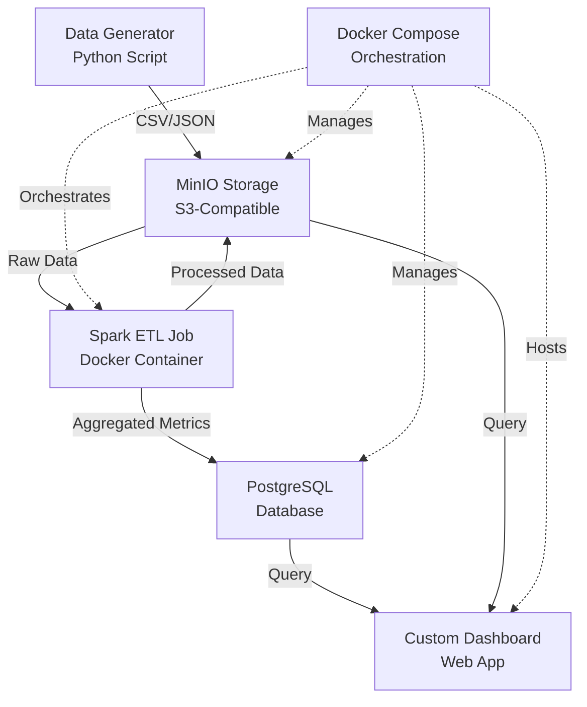

# Starlink ETL Pipeline

A complete end-to-end ETL pipeline for processing Starlink satellite data using Apache Spark, Docker containers, Python, and a custom web dashboard. **100% free and local** - uses MinIO (S3-compatible storage) and PostgreSQL instead of AWS services.

## 🏗️ Architecture



## 📁 Project Structure

```
janelaxy_starlink/
├── data_generator/          # Simulated data generation
│   ├── generator.py         # Main data generator script
│   ├── satellite_simulator.py
│   ├── Dockerfile
│   └── requirements.txt
├── spark_etl/               # Spark ETL jobs
│   ├── jobs/
│   │   ├── extract.py       # Data extraction logic
│   │   ├── transform.py     # Spark transformations
│   │   ├── load.py          # Data loading to S3/DB
│   │   └── main.py          # Main ETL orchestrator
│   ├── Dockerfile
│   └── requirements.txt
├── dashboard/               # Custom web dashboard
│   ├── app.py              # Flask backend
│   ├── templates/          # HTML templates
│   │   └── index.html
│   ├── Dockerfile
│   └── requirements.txt
├── infrastructure/          # AWS infrastructure as code
│   ├── docker-compose.yml  # Local development
│   ├── s3_setup.sh         # S3 bucket setup
│   ├── ecs_cluster_setup.sh # ECS cluster setup
│   ├── ecs-task-definition.json
│   ├── iam_policy.json     # IAM permissions
│   └── rds_setup.sql       # Database schema
├── scripts/                 # Utility scripts
│   ├── deploy.sh           # Deployment script
│   └── setup_aws.sh        # AWS setup
└── README.md
```

## 🚀 Quick Start

### Prerequisites

- Python 3.9+ (optional, for local development)
- Docker and Docker Compose
- **No AWS account needed!** Everything runs locally for free.

### Quick Start (Local Setup)

1. **Clone the repository**
   ```bash
   cd janelaxy_starlink
   ```

2. **Run the setup script**
   ```bash
   ./scripts/setup_local.sh
   ```
   
   This will:
   - Start MinIO (S3-compatible storage) on port 9000
   - Start PostgreSQL database on port 5432
   - Start the dashboard on port 5000
   - Initialize MinIO buckets

3. **Generate sample data**
   ```bash
   cd infrastructure
   docker-compose --profile generator run --rm data-generator
   ```

4. **Run ETL job**
   ```bash
   docker-compose --profile etl run --rm spark-etl
   ```

5. **Access the dashboard**
   Open your browser to `http://localhost:5000`

6. **Access MinIO Console** (optional)
   Open `http://localhost:9001` (login: minioadmin/minioadmin)

## 📊 Data Generation

The data generator creates simulated Starlink satellite data including:

- **Satellite Positions**: ID, timestamp, latitude, longitude, altitude, velocity, status
- **Coverage Data**: Region ID, coverage percentage, satellite count, signal strength
- **Performance Metrics**: Latency, throughput, availability by region

### Usage

```bash
# Generate data locally
cd data_generator
python generator.py --output-dir ./data --format csv --num-satellites 100 --hours 24

# Or using Docker
docker-compose --profile generator run --rm data-generator
```

### Options

- `--output-dir`: Output directory for generated data
- `--format`: Output format (csv, json, parquet)
- `--num-satellites`: Number of satellites to simulate
- `--hours`: Number of hours of data to generate
- `--frequency`: Data generation frequency in minutes

## ⚙️ ETL Pipeline

The Spark ETL pipeline consists of three main phases:

### 1. Extract
- Reads data from S3 raw data bucket
- Supports CSV, JSON, and Parquet formats
- Validates schemas and handles errors gracefully

### 2. Transform
- Cleans and validates satellite data
- Calculates orbital metrics
- Aggregates statistics by region and time windows
- Joins multiple data sources

### 3. Load
- Writes processed data to S3 in Parquet format
- Loads aggregated metrics to RDS PostgreSQL
- Partitions data for efficient querying

### Running the ETL Job

```bash
# Local execution
cd spark_etl
spark-submit --master local[*] jobs/main.py \
  --s3-raw-bucket starlink-etl-raw-data \
  --s3-processed-bucket starlink-etl-processed \
  --s3-checkpoint-bucket starlink-etl-checkpoints \
  --file-format csv \
  --rds-host localhost \
  --rds-port 5432 \
  --rds-database starlink \
  --rds-user postgres \
  --rds-password postgres

# Docker execution
docker-compose --profile etl run --rm spark-etl
```

## 🌐 Dashboard

The custom web dashboard provides:

- Real-time satellite statistics
- Coverage maps by region
- Performance metrics visualization
- Interactive charts and graphs
- Satellite position mapping

### API Endpoints

- `GET /api/health` - Health check
- `GET /api/satellite/stats?hours=24` - Satellite statistics
- `GET /api/coverage/stats?region=NA&hours=24` - Coverage statistics
- `GET /api/performance/stats?region=NA&hours=24` - Performance metrics
- `GET /api/dashboard/summary?hours=24` - Dashboard summary

## 🐳 Docker Compose Services

The pipeline runs entirely on Docker Compose with these services:

- **MinIO**: S3-compatible object storage (replaces AWS S3)
  - API: `http://localhost:9000`
  - Console: `http://localhost:9001` (minioadmin/minioadmin)
  
- **PostgreSQL**: Local database (replaces AWS RDS)
  - Host: `localhost:5432`
  - Database: `starlink`
  - User: `postgres` / Password: `postgres`

- **Dashboard**: Web application
  - URL: `http://localhost:5000`

- **Spark ETL**: Runs on-demand via Docker Compose profiles

### Managing Services

```bash
cd infrastructure

# Start all services
docker-compose up -d

# Stop all services
docker-compose down

# View logs
docker-compose logs -f dashboard
docker-compose logs -f spark-etl

# Restart a service
docker-compose restart dashboard
```

## 🔧 Configuration

### Environment Variables

All services are pre-configured in `docker-compose.yml`. You can override these:

**Data Generator:**
- `S3_BUCKET`: MinIO bucket for raw data (default: `starlink-etl-raw-data`)
- `S3_ENDPOINT_URL`: MinIO endpoint (default: `http://minio:9000`)
- `MINIO_ACCESS_KEY`: MinIO access key (default: `minioadmin`)
- `MINIO_SECRET_KEY`: MinIO secret key (default: `minioadmin`)

**Spark ETL:**
- `S3_ENDPOINT_URL`: MinIO endpoint (default: `http://minio:9000`)
- `MINIO_ACCESS_KEY`: MinIO access key (default: `minioadmin`)
- `MINIO_SECRET_KEY`: MinIO secret key (default: `minioadmin`)

**Dashboard:**
- `RDS_HOST`: PostgreSQL host (default: `postgres`)
- `RDS_PORT`: PostgreSQL port (default: `5432`)
- `RDS_DATABASE`: Database name (default: `starlink`)
- `RDS_USER`: Database user (default: `postgres`)
- `RDS_PASSWORD`: Database password (default: `postgres`)
- `S3_PROCESSED_BUCKET`: MinIO bucket for processed data (default: `starlink-etl-processed`)
- `S3_ENDPOINT_URL`: MinIO endpoint (default: `http://minio:9000`)

## 📈 Data Schema

### Satellite Data
- `satellite_id`: Unique satellite identifier
- `timestamp`: Data timestamp
- `latitude`: Satellite latitude (-90 to 90)
- `longitude`: Satellite longitude (-180 to 180)
- `altitude`: Orbital altitude in km
- `velocity`: Orbital velocity in km/s
- `status`: Operational status (operational, maintenance, standby)

### Coverage Data
- `region_id`: Region identifier (NA, EU, AS, SA, OC)
- `timestamp`: Data timestamp
- `coverage_percentage`: Coverage percentage (0-100)
- `satellite_count`: Number of satellites in range
- `avg_signal_strength`: Average signal strength in dBm

### Performance Metrics
- `timestamp`: Data timestamp
- `region`: Region identifier
- `latency_ms`: Network latency in milliseconds
- `throughput_mbps`: Network throughput in Mbps
- `availability_percentage`: Service availability percentage

## 🧪 Testing

### Complete Pipeline Test

1. Start all services:
   ```bash
   cd infrastructure
   docker-compose up -d
   ```

2. Generate test data:
   ```bash
   docker-compose --profile generator run --rm data-generator
   ```

3. Upload data to MinIO (optional, if generator saved locally):
   ```bash
   # Using MinIO client (mc)
   docker-compose run --rm minio-init mc cp /app/data/*.csv myminio/starlink-etl-raw-data/
   ```

4. Run ETL:
   ```bash
   docker-compose --profile etl run --rm spark-etl
   ```

5. Verify in dashboard:
   - Open `http://localhost:5000`
   - Check that data appears in visualizations

6. Verify in MinIO Console:
   - Open `http://localhost:9001`
   - Check buckets for processed data

## 🔍 Monitoring

### Viewing Logs

All services log to Docker:

```bash
cd infrastructure

# View all logs
docker-compose logs -f

# View specific service logs
docker-compose logs -f dashboard
docker-compose logs -f spark-etl
docker-compose logs -f postgres
docker-compose logs -f minio
```

### Dashboard Health

Check dashboard health:
```bash
curl http://localhost:5000/api/health
```

### MinIO Console

Access MinIO web console:
- URL: `http://localhost:9001`
- Username: `minioadmin`
- Password: `minioadmin`

## 🛠️ Troubleshooting

### Common Issues

1. **MinIO Connection Failed**
   - Ensure MinIO container is running: `docker-compose ps`
   - Check MinIO logs: `docker-compose logs minio`
   - Verify endpoint URL is correct (should be `http://minio:9000` from within containers)

2. **PostgreSQL Connection Failed**
   - Ensure PostgreSQL container is healthy: `docker-compose ps`
   - Check PostgreSQL logs: `docker-compose logs postgres`
   - Verify connection string uses `postgres` as hostname (not `localhost`) from within containers

3. **Spark Job Fails**
   - Check Spark logs: `docker-compose logs spark-etl`
   - Verify MinIO buckets exist (run `docker-compose --profile init run --rm minio-init`)
   - Ensure data files are in MinIO: check MinIO console at `http://localhost:9001`

4. **Dashboard Shows No Data**
   - Verify PostgreSQL has data: connect and query tables
   - Check database connection settings in dashboard logs
   - Verify ETL job completed successfully
   - Check time range in dashboard queries

5. **Port Already in Use**
   - Stop conflicting services or change ports in `docker-compose.yml`
   - Check what's using the port: `lsof -i :5000` (or your port)

## 💰 Cost

**This setup is 100% FREE!** 

- No AWS costs - everything runs locally
- No cloud service subscriptions needed
- Uses open-source technologies:
  - MinIO (S3-compatible storage)
  - PostgreSQL (open-source database)
  - Apache Spark (open-source)
  - Docker (free)

## 🔄 Migration from AWS

If you were using AWS before, the code is compatible with both:
- Set `S3_ENDPOINT_URL` to `http://minio:9000` for local MinIO
- Leave `S3_ENDPOINT_URL` unset to use AWS S3
- The same applies to database: use `postgres` hostname for local, or RDS endpoint for AWS

## 📝 License

This project is provided as-is for educational and demonstration purposes.

## 🤝 Contributing

Contributions are welcome! Please feel free to submit issues or pull requests.

## 📧 Contact

For questions or support, please open an issue in the repository.

